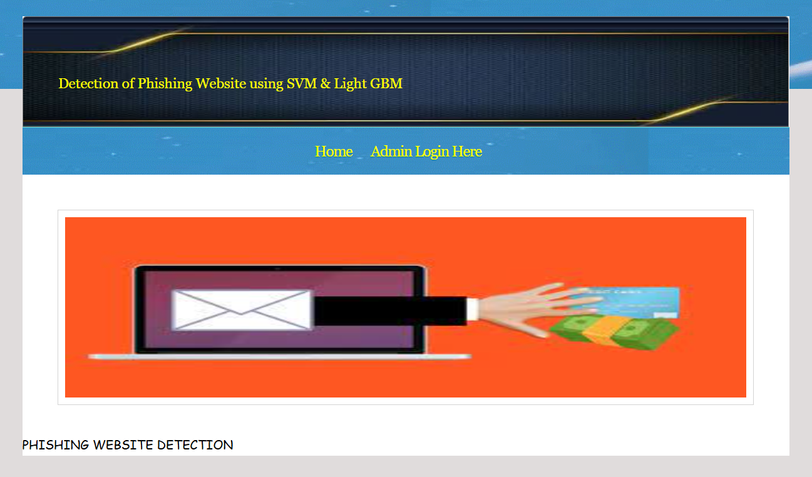
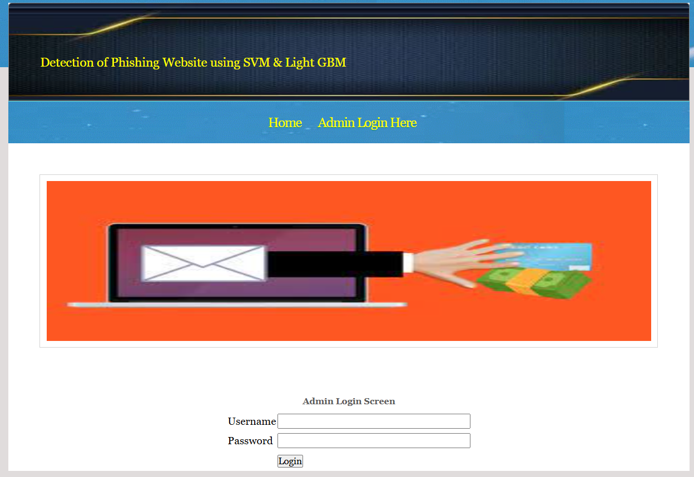
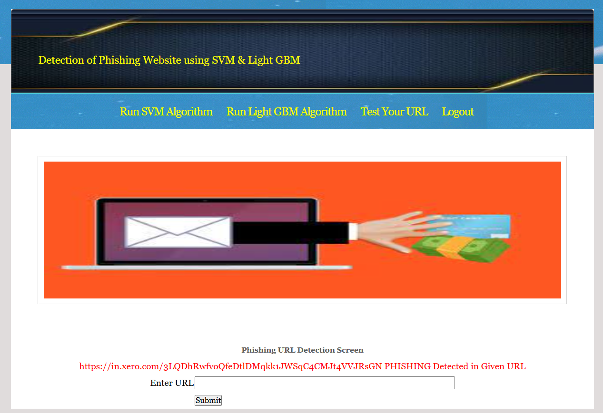
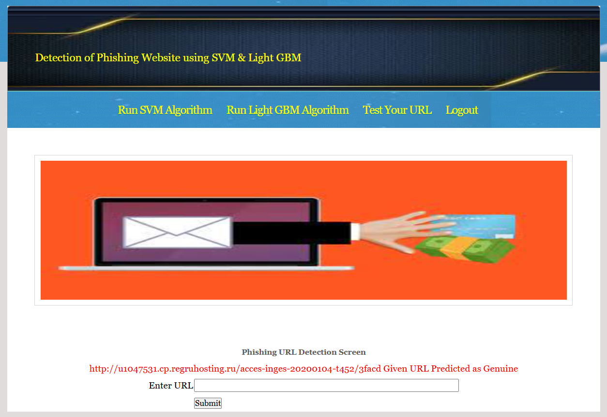
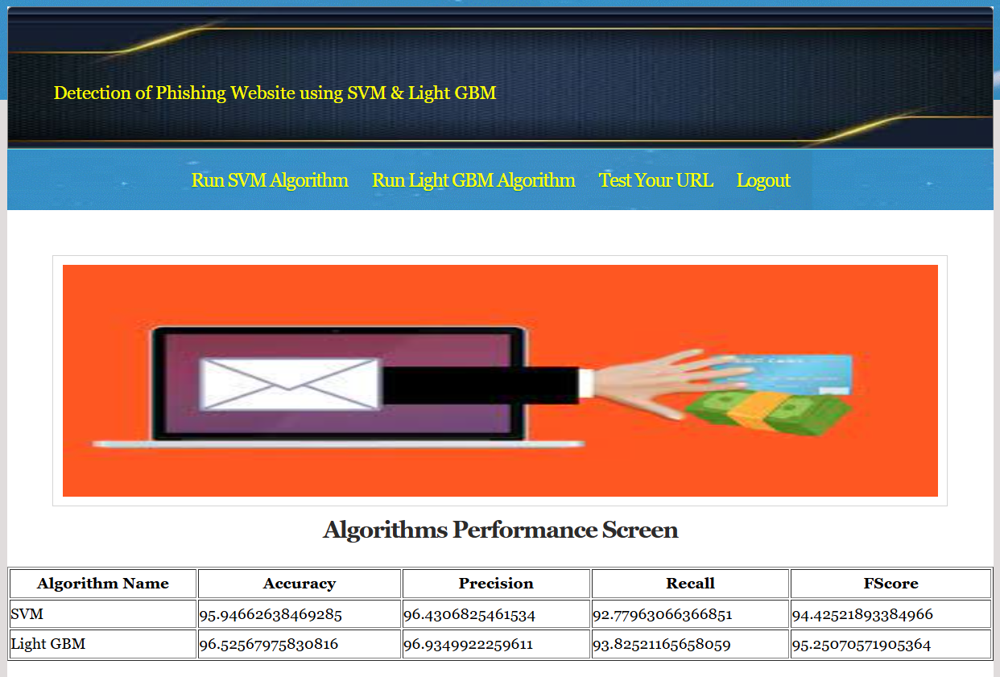

# 🛡️ Phishing URL Detection using Machine Learning

A Machine Learning-based web application built with **Django** that detects whether a website URL is **Legitimate** or **Phishing**. The application uses multiple supervised machine learning algorithms to analyze URLs and predict their legitimacy with high accuracy.

---

# 📌 Project Overview

Phishing websites are one of the most common cybersecurity threats. Attackers create fake websites that closely resemble trusted websites to steal sensitive information such as usernames, passwords, banking credentials, and personal information.

This project uses Machine Learning techniques to classify URLs as either:

- ✅ Legitimate Website
- 🚨 Phishing Website

The trained model is integrated into a Django web application that provides instant predictions through a simple user interface.

---

# 🚀 Features

- Detects phishing websites in real-time
- Django-based web application
- User-friendly interface
- Multiple Machine Learning models
- Fast URL prediction
- Admin Login Panel
- Responsive web pages
- Easy deployment

---

# 🛠️ Technology Stack

## Frontend

- HTML5
- CSS3

## Backend

- Python
- Django

## Machine Learning

- Scikit-learn
- LightGBM
- Random Forest
- Support Vector Machine (SVM)
- TF-IDF Vectorization

## Database

- SQLite3

---

# 📂 Project Structure

```
phishing-url-detection-ml/
│
├── Dataset/
├── model/
├── PhishingDetection/
├── PhishingDetectionApp/
├── screenshots/
├── static/
├── templates/
├── manage.py
├── requirements.txt
└── README.md
```

---

# 📊 Dataset

The model is trained using both phishing and legitimate website URLs.

### Phishing URLs

Collected from **PhishTank**, an open-source phishing URL repository.

https://www.phishtank.com/

### Legitimate URLs

Collected from the **Canadian Institute for Cybersecurity (University of New Brunswick)**.

https://www.unb.ca/cic/datasets/url-2016.html

The dataset contains approximately **10,000 URLs**, including both phishing and legitimate websites.

---

# 🔍 Feature Engineering

A total of **17 handcrafted features** were extracted from every URL.

### Address Bar Features

- URL Length
- Prefix/Suffix
- HTTPS Token
- Special Characters
- Shortening Services
- and more...

### Domain Features

- Domain Age
- DNS Record
- Website Traffic
- Domain Registration

### HTML & JavaScript Features

- iFrame Detection
- Mouse Over Events
- Right Click Disabled
- Popup Windows

These extracted features are used to train the Machine Learning models.

---

# 🤖 Machine Learning Models

The following supervised classification algorithms were evaluated:

- Decision Tree
- Random Forest
- Support Vector Machine (SVM)
- LightGBM

The best-performing model is integrated into the Django application for real-time URL prediction.

---

# ⚙️ Machine Learning Workflow

```
Dataset Collection
        │
        ▼
Feature Extraction
        │
        ▼
Data Preprocessing
        │
        ▼
Train/Test Split
        │
        ▼
Model Training
        │
        ▼
Performance Evaluation
        │
        ▼
Save Trained Model
        │
        ▼
Django Web Application
        │
        ▼
Real-Time URL Prediction
```

---

# 📈 Model Prediction Flow

```
User Enters URL
        │
        ▼
URL Preprocessing
        │
        ▼
TF-IDF Vectorization
        │
        ▼
Machine Learning Model
        │
        ▼
Prediction
        │
        ├──────────────► Legitimate Website ✅
        │
        └──────────────► Phishing Website 🚨
```

---

# 📷 Application Screenshots

## 🏠 Home Page



---

## 🔐 Admin Login



---

## 🚨 Phishing URL Detection



---

## ✅ Legitimate URL Detection



---

## 📊 Model Performance



---

# ⚡ Installation

## Clone Repository

```bash
git clone https://github.com/D-Purnachandrarao/phishing-url-detection-ml.git
```

---

## Move into Project

```bash
cd phishing-url-detection-ml
```

---

## Create Virtual Environment

### Windows

```bash
python -m venv venv
venv\Scripts\activate
```

### Linux / macOS

```bash
python3 -m venv venv
source venv/bin/activate
```

---

## Install Dependencies

```bash
pip install -r requirements.txt
```

---

## Run Development Server

```bash
python manage.py runserver
```

Open your browser and visit:

```
http://127.0.0.1:8000/
```

---

# 📦 Requirements

Main libraries used:

- Django
- NumPy
- Pandas
- Scikit-learn
- LightGBM
- Joblib

Install all dependencies using:

```bash
pip install -r requirements.txt
```

---

# 📈 Future Improvements

- Browser Extension
- REST API
- User Authentication
- User Dashboard
- URL Scan History
- Cloud Deployment (Render/Vercel/AWS)
- Deep Learning Models
- Real-Time Threat Intelligence APIs

---

# 🎯 Learning Outcomes

Through this project, I gained practical experience in:

- Machine Learning Model Development
- Feature Engineering
- Data Preprocessing
- Model Evaluation
- Django Web Development
- Python Programming
- Git & GitHub
- Web Application Deployment

---

# 👨‍💻 Author

## **Purna Chandra Rao Dantala**

**GitHub**

https://github.com/D-Purnachandrarao

---

# ⭐ Support

If you found this project useful, consider giving it a ⭐ on GitHub.

---

# 📄 License

This project is developed for educational, learning, and portfolio purposes.

---

## 🏆 GitHub Achievements

[](https://github.com/ryo-ma/github-profile-trophy)
